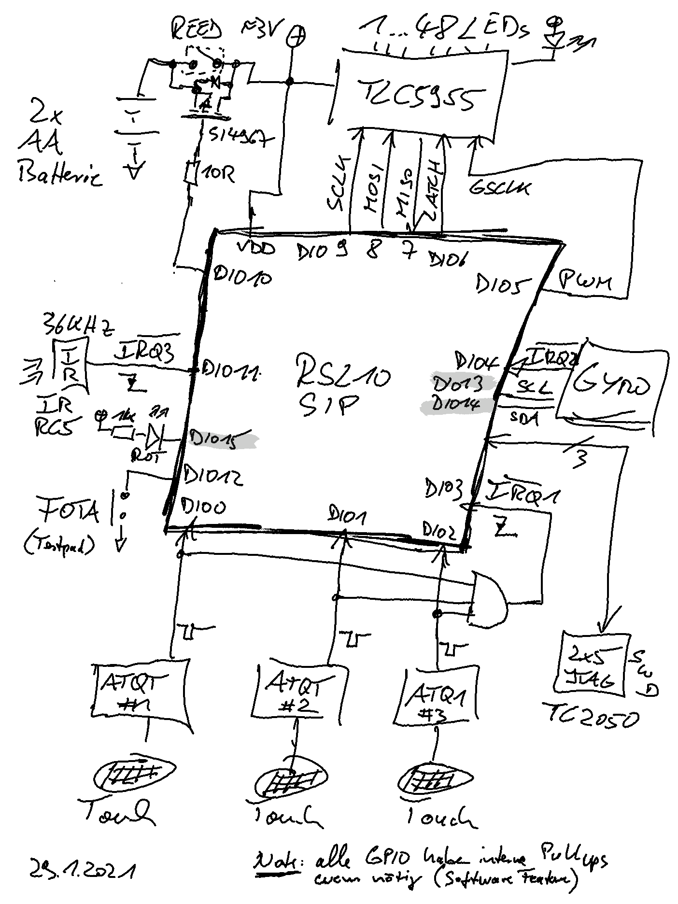
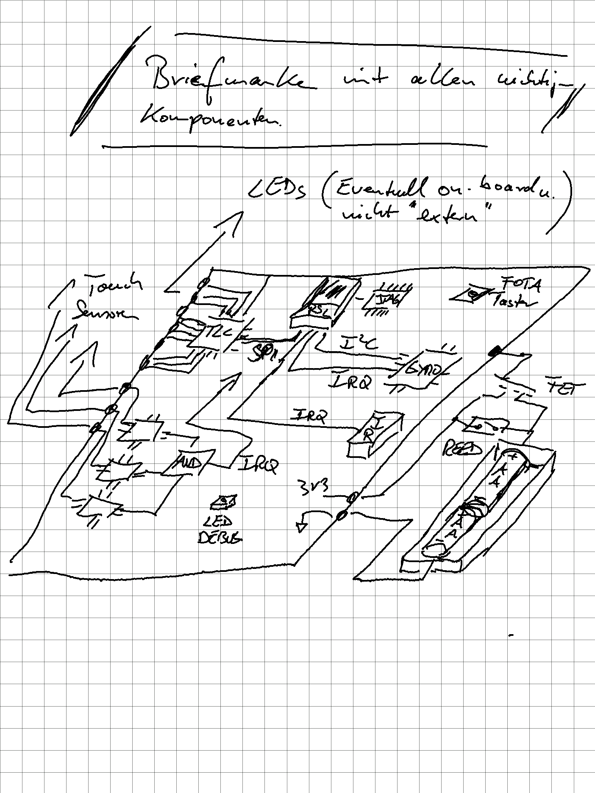
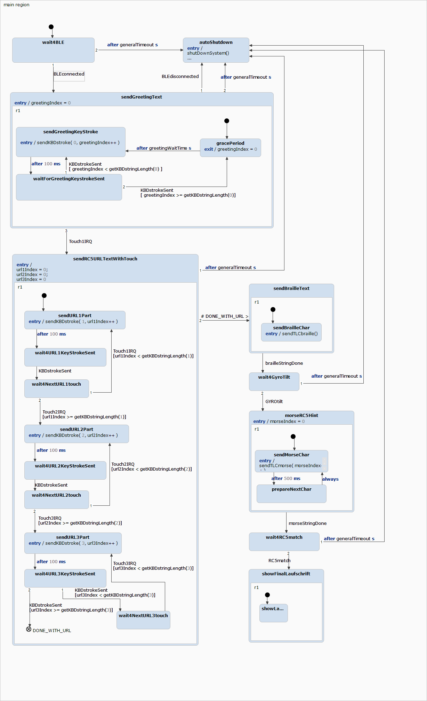
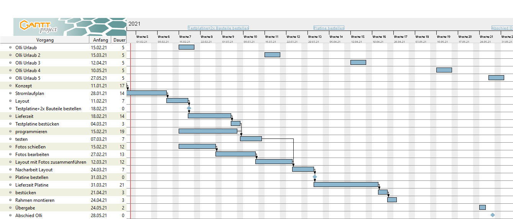

# Project5
TOP SECRET ;-)

Das wird das Abschiedsgeschenk der HARDWARE Abteilung an Olli, der im Mai 2021 in den Ruhestand geht.

Installation der nötigen Toolchain wird hier beschrieben: https://www.onsemi.com/forum/t/kb-getting-set-up-with-the-rsl10-sdk-eclipse-ide/175

Google Document: https://docs.google.com/document/d/1JKzkXg6ti9WWn0LwGXhklhcn5QAyDSN7pkyqg-pgIvA/edit?usp=sharing

