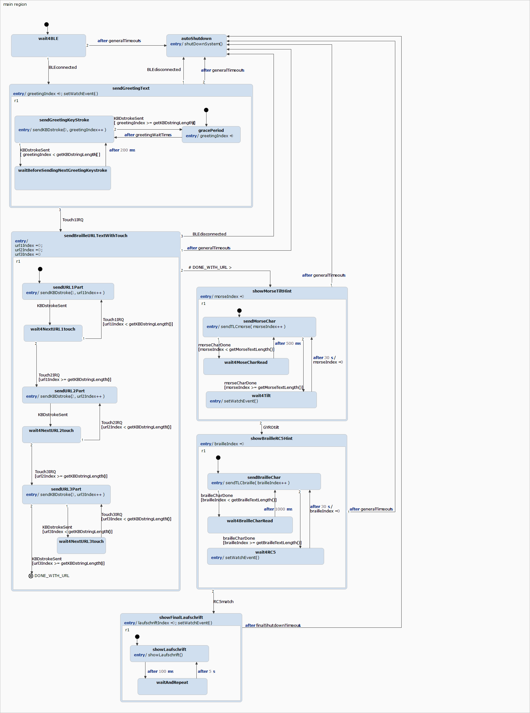

# Project5
TOP SECRET ;-)

Das wird das Abschiedsgeschenk der HARDWARE Abteilung an Olli, der im Mai 2021 in den Ruhestand geht.

Herz der Elektronik ist ein RSL10 von ONSEMI. Dieser implementiert ein paar Rätsel, die es Stück für Stück zu lösen gilt. Final erhält man als Laufschrift die URL einer Webseite.

Installation der nötigen Toolchain wird hier beschrieben: https://www.onsemi.com/forum/t/kb-getting-set-up-with-the-rsl10-sdk-eclipse-ide/175

Google Document: https://docs.google.com/document/d/1JKzkXg6ti9WWn0LwGXhklhcn5QAyDSN7pkyqg-pgIvA/edit?usp=sharing

